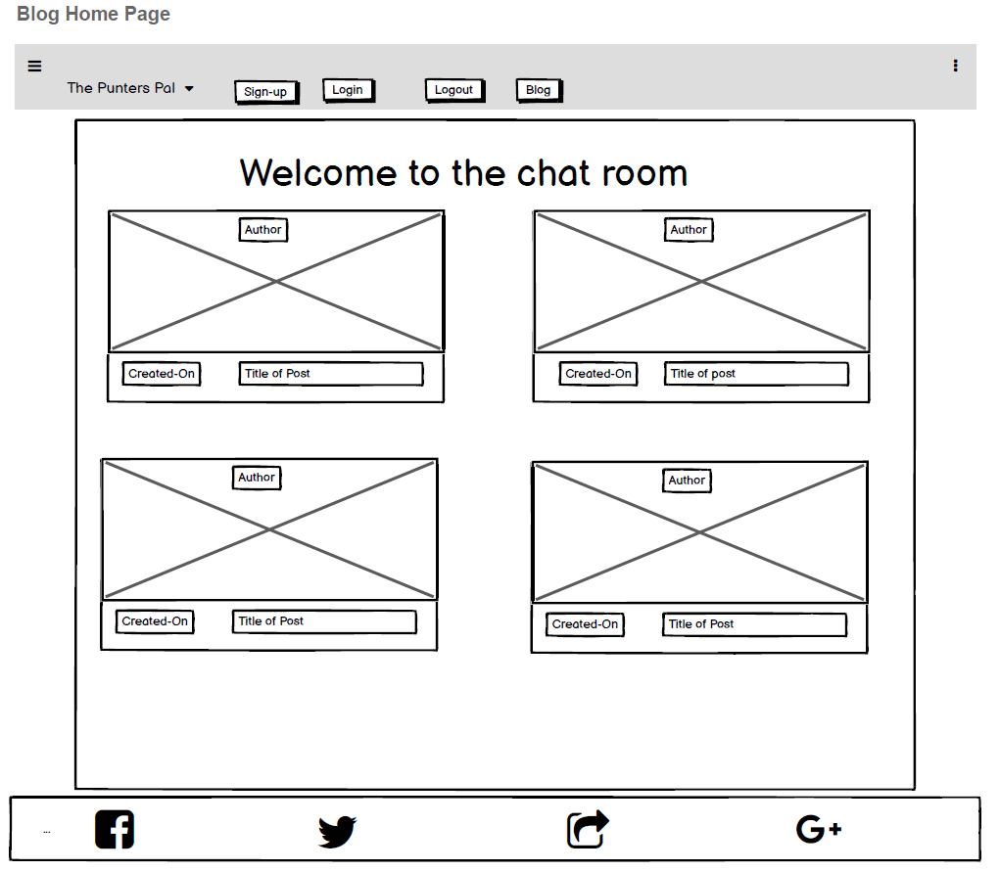

# Punters Pal - A diary structred for, and aimed at, the Horse-Racing Community.

  

  

# 
 - Intended Purpose of This Website:

  - The intended purpose of this website was to build a simple diary that a race-goer could use to enter race information relating to a horses run. The user has access to a form field on login where they can quickly enter an entry to their diary. The diary is formatted to allow the user enter details about the track, race type, horses name, grade, distance, going, trainer, jockey, number of runners, resulting position of entry, result of the race (1,2,3), and a text area where they can enter some of their own insights about the race or why they are following the horse to begin with. Only registered users can use the diary feature. A blog was provided to give unregistered users something to browse after landing on the website.

## Table of contents
- <a href="#ui">UI/UX</a>
- <a href="#thm">Themes</a>
- <a href="#epi">Epics</a>
- <a href="#us">User Stories</a>
- <a href="#de">Design</a>
- <a href="#wire">Wireframes</a>
- <a href="#erd">ERD Diagram</a>
- <a href="#lf">Live Features</a>
- <a href="#df">Desired Features</a>
- <a href="#tpy">Automated Testing(Python)</a>
- <a href="#mnts">Manual Testing</a>
- <a href="#dep">Deployment</a>
- <a href="#b">Bugs During Development</a>
- <a href="#ub">Unsolved Bugs</a>
- <a href="#tu">Technologies Used</a>
- <a href="#cr">Credits</a>

<a href="#intro">Return to table of contents</a>

# UI-UX

  ## Site Purpose

  - The Purpose of this website is to have a structured note taking application for members of the Racing Community so they can keep a record of horses they want to follow in the future and why they chose to follow them. It will allow users to make structured but personalised entries into the diary and act as a personal database for them. They should have full CRUD functionality for their diary entries.

  ## Site Goal and Intended Audience

  - Appeal to members of the Racing Community. Give these users a personal, digitalized option to store and track information relating to horses they wish to follow.

<a href="#intro">Return to table of contents</a>

# Themes

- Design a site that is useful for people who want to track horses they like.

<a href="#intro">Return to table of contents</a>

# Epics

- The Unregistered User

- The Registered User

<a href="#intro">Return to table of contents</a>

# User Stories

## As an unregistered user I can relate to the appeal of this website so that I am encouraged to sign up.

  ### Acceptance Criteria
  - Landing page content must appeal to the target audience.

  - Title must communicate the sites goals clearly.

  - Imagery used must appeal to the target audience.

  ### Tasks
  - Source images for landing page to appeal to a racing audience.

  - Create a title that will explain what the sites purpose is.

## As an unregistered user I can sign up easily so that I can use the websites full features.

  ### Acceptance Criteria
  - Users must understand when on the landing page that the diary is for registered users only.

  - Functionality to create an account must be present in more than one location.
  
  ### Tasks
  - Explain the sites purpose clearly in the content description.

  - Create sign up button in the nav-bar.

  - Build a 'create account' button under the landing page content area.

## As an unregistered user I can have the option to authenticate my email address as an option during sign in

  ### Acceptance Criteria
   - All-auth is implemented correctly.

   - Users can login successfully with an email address.

  ### Tasks
   - Implement all-auth for user sign in.

## As an unregistered user I can have the option to authenticate myself using my google account as an option during sign in

  ### Acceptance Criteria
  - Users can succesfully login with their google account credentials.

  ### Tasks
  - Implement sign in via google. 

## As a registered user I can login and logout of my account so that my account is unique to me.

  ### Acceptance Criteria
  - Users are taken to the correct locations on the site when logged in an logged out.

  ### Tasks
  - Implement login and logout redirects for all-auth.

  - Login will bring user to the create new entry page.

  - Logout will bring the user to the landing page.

## As a registered user I can access the capability of using the diary so that I can keep track of horses I like

  ### Acceptance Criteria
  - Registered users have full use of the site. Unregistered can only read the blog.

  ### Tasks
  - Give registered users only access to the create entry page using 'if is_authenticated'.

## As a registered user I can be redirected to the 'create new diary entry page' so that I can make a rapid entry

  ### Acceptance Criteria
  - Users should have multiple options available to get back to the create new entry page from all locations within the site which make sense to have the option.

  ### Tasks
  - Build create new entry button into navbar on page for viewing entries.

  - Build create new entry button into every entry in the diary alongside the edit entry button.

## As a registered user I can have access to a structured note entry functionality so that all of my notes are structured and organised

  ### Acceptance Criteria
  - Users have all the fields necessary to take a detailed note on the result of a horse race.

  ### Tasks
  - Build all the fields on the 'Create Entry' data model based on the fields that would be typically given on a result/form so users can record relevant information.

## As a registered user I can see my notes presented to me organised and visually appealing so that I can re-read my notes comfortably

  ### Acceptance Criteria
  - Build a seperate page where users can see the information they entered presented back to them clean, organised, easy to read.

  ### Tasks
  - Create a view entry page. All data to be organised logically and easy to read. 

## As a registered user I can perform full CRUD functionality on my notes so that I can I can control all of the entries

  ### Acceptance Criteria
  - Users can Create, Read, Update and Delete notes from their diary.

  ### Tasks
  - Implement full CRUD functionality for users note entries.

## As a registered user I can search my notes so that they are easy to find when needed

  ### Acceptance Criteria
  - Users can search their note entries.

  ### Tasks
  - Implement a search diary functionality.

  - Users can be redirected to the same page but only view the searched entry.

## As a registered user I can comment, like, and share posts in the blog so that the website is more appealing

  ### Acceptance Criteria
  - Users can can read, comment, like and share blog posts.

  ### Tasks
  - Populate the blog with some interesting articles.
  
  - Implement functionality to comment on the blog posts.

  - Implement functionality to like the blog posts.

  - Implement functionality to share the blog posts.

## As a User I can access the blog so that read articles and chat to people in my community

  ### Acceptance Criteria
  - All users should be able to view the blog regardless of whether they have an account.

  ### Tasks
  - Allow all users to view the blog

<a href="#intro">Return to table of contents</a>

# Design

  - Color Pallete
    - #f4f5f7
    - #261717
    - #cdb06f
    - #d9d3cf 

  - Fonts
    - Railway
    - Nunito

  

<a href="#intro">Return to table of contents</a>

# Wireframes

  - Title of the wireframe

  

  

  

  

  

  

  

<a href="#intro">Return to table of contents</a>

# ERD Diagram

  - Title of ERD Diagram

  

<a href="#intro">Return to table of contents</a>

# Live Features

  ## Landing page with option to create a new account.

  

  ## Sign up page. Users can use the custom styled all auth forms or use their google accounts to sign up/login.

  

  

  

  

  

  

  ## Custom styled form structured for input related to racing. User welcomed by name.

  

  

  ## Diary entries sorted and displayed nicely. Users can edit and delete entries in their diary.

  

  

  

  

  ## Search diary by Horse Name to find selections.

  

  

  ## Blog content

  

  

  

  

  ## Blog Detail
  

  

<a href="#intro">Return to table of contents</a>

# Desired Features

  ### Chat room
    - Users given the opportunity to build a community and chat to like minded people
  ### Search notes (All criteria)
    - Users given the functionality to search the diary by any criteria they want to use
  ### Expand information relating to an entry
    - Users given another window where they can fill out detailed bio on any of their entries. Specific to the entry in question. Age, sire, value, breeder etc.
  ### External API
    - Use an external API to grab result data and populate the diary. API could also be used to access video content relating to each entry.

  

  

  ### Full google auth functionality
    - Currently users can only sign in with google via a seperate page. Users should have immediate sign-up/login functionality using googles custom buttons.
  ### Batch diary entries
    - When the diary has hundreds of entries it would be nice to have the ability to batch the entries by trainer, age, ability etc and store them together so they can be accessed more easily.

<a href="#intro">Return to table of contents</a>

# Testing (Python)

  ### Run 14 automated tests using Python's UnitTest
  - Testing here is for the diary app of this project.
  

  

  ### Coverage Report
  

  

<a href="#intro">Return to table of contents</a>

# Manual Testing

  ### Lighthouse Test
    - Lighouse report indicated good accesibility, SEO and Best practices scores.

  

  ### HTML validator
    - The HTML validator had issues with some of the django syntax but was otherwise passed as valid HTML.

  

  

  ### CSS validator
    - The CSS was passed by the validator as valid CSS.

  

  

  ### Pycodestyle
    - Pycodestyle linter was used in gitpod to test all the python code. The only issues were line too long errors in the original settings.py file and the urls.py file.

<a href="#intro">Return to table of contents</a>

# Deployment

  ### Early Deployment
  - This project was deployed early using the following approach:
    - Install django, gunicorn and supporting libraries including psycopg2
    - Install cloudinary libraries
    - Create a project, an app, and a requirements.txt file
    - Add app to installed apps
    - Migrate changes
    - Runserver and test
    - Create Heroku app
    - Attatch to the database
    - Set up env.py file and settings.py file
    - Set static and media files to store in cloudinary
    - Create a procfile
    - Push code to github
    - Deploy from heroku using git 

  ### Final Deployment
  - Set Debug to False for final deployment and remove commented out local database code.

  

<a href="#intro">Return to table of contents</a>

# Bugs (During Development)

  - Unable to get google authentication to work properly due to the random URI that gitpod generates. I could not get google to recognise the URI but managed a workaround for now. I might clone the project at a later date in VS code and add the full functionality in. At present the  link will take you to the sign in page which runs the correct login URL on sign up.

  - Difficulty getting the bootstrap header to behave on various screen sizes. Setting the Viewport with to 70vw on the navbarbrand bootstrap class and floating the logo right solved this in the end.

  - Inconsistent migration history. I two seperate instances of messing up the database history.

  - One when we had to switch over to elephant sql for the database. I tried to use the local database to run some tests and when I went back to the deployment database it did not recognise me.

  - Another instance was adding a social account to the database from the admin before I saved the django.contrib.sites to the APPS list in settings.py. I had to wipe the database and start again after making this mistake

  

<a href="#intro">Return to table of contents</a>

# Bugs (Unsolved)

  - The racetype charfield in the diaryentry model threw a not null exception even though other charfields did not. A value of race remains for the field value. I believe it was due to the fact that this field was added after the database was created. To solve it I might need to clean the database completely and delete the migrations file and re-make new migrations again.

  

<a href="#intro">Return to table of contents</a>

# Technologies Used

  - Django

  - Python

  - CSS

  - Javascript

  - HTML

  - Bootstrap

  - PostgreSQL

# Libraries/Frameworks and Other Tools Used

  - Balsamiq for wireframes

  - Fiverr Logo maker for logo and favicon

  - GitPod as the IDE

  - Github for version control

  - Django allauth (including social account)

  - Django crispy forms

  - gunicorn

  - Cloudinary

  

<a href="#intro">Return to table of contents</a>

# Credits

  - Images
    - Pexels.com for most of the images. (Some imagery used in the blog is credited in the blog itself in the comments section)

  - Media
    - The content for the blog is credited in the comments section of each post. 

  - Walkthrough Code from Code Institute for the blog. Only minor style changes were made to the blog code.

  - Tutor Support

    - Help from Sean in Tutor support with the following code on the 16-10-2022:
            

              instance = new_entry.save(commit=False) 
              instance.created_by = User.objects.get(username=request.user.username) 
              instance.save()
            

    - The code above helped to solve a technical issue whereby I was rendering a form for the user to enter data and I did not want the created_by field to be seen by the user but it was a ForeignKey field and threw a violates not null exception when left blank. This code helped me to create an instance of the new_entry and set its ForeignKey to the users username before committing it to the database thus resolving the error.

  - External Code

    - This code was taken from stack overflow to help with using an anchor tag as a button to avoid nesting one inside the other and causing invalid HTML code.
            

             a.button { 
            -webkit-appearance: button; 
            -moz-appearance: button; 
            appearance: button; 
            text-decoration: none; 
            color: initial; 
            }
            

    - Bootstrap: Used for responsive footer and navbar and its grid layout.

  

